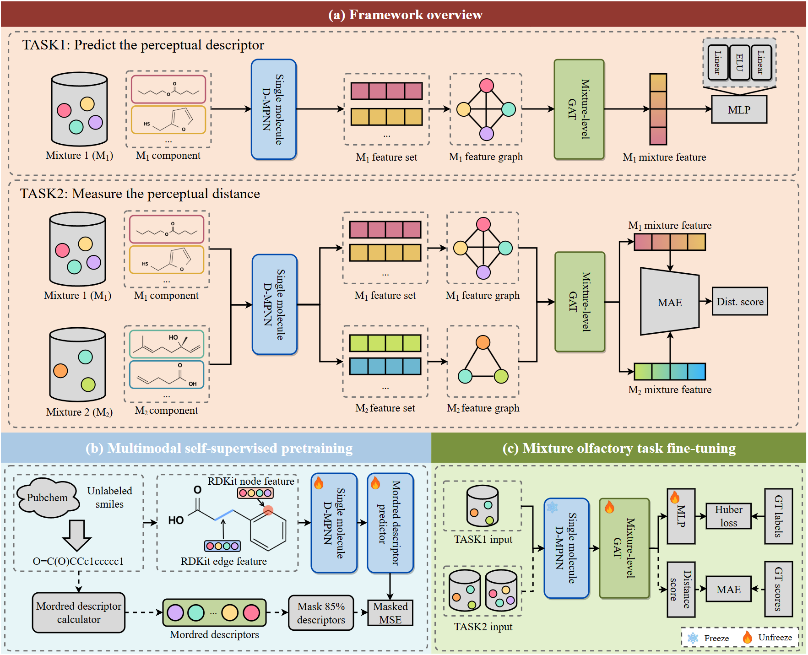

# MixScentNet: A Multiscale Graph-based Framework for Predicting Scent Mixture Perception

The official code reporsority for MixScentNet, accepted by NeurIPS 2026. The MixScentNet models molecule mixtures as complete graphs, combining self-supervised pretraining on Mordred descriptors with a 3-layer residual GATv2, achieving competitive performance on olfactory label and perceptual distance prediction and reproducing olfactory white.

> **NeurIPS2026** | [Paper]() | [Poster & Video](https://neurips.cc/virtual/2026/loc/sydney/poster/154439) 

<p align="center">
  
</p>

---
## 🔈 Updates:
4/Oct./2026:
- Uploading the pretraining codes for DMPNN (DMPNN_pretrain folder)

2/Oct./2026: 
- Uploading the 'DREAM2024_official_Similarity_valid-test.py' (MixScentNet's DREAM2024 official test set performance);
- 'DREAM2025_official_Label_Leaderboard.py' (MixScentNet's DREAM2025 official leaderboard set performance); 
- ['DMPNN_PubChem_20260315.pt'](https://drive.google.com/file/d/1U4LUAXgefZZmOazBdnNXP2vI9SiNkbkk/view?usp=drive_link)

Quick link checking the official results:
- DREAM2024 official test set: https://www.synapse.org/Synapse:syn62786069/tables/
- DREAM2025 official Leaderboard: https://www.synapse.org/Synapse:syn66484079/tables/

**NOTE**: the DREAM2025 doesn't release the official test set (2/Oct./2026), and there is a **data leakage** issue on the DREAM2024 Leaderboard, so we don't report results on DREAM2024 Leaderboard set.

---

## 📁 Repository Structure

```
MixScentNet/
├── MixScentNet_Label.py              # Entry point: DREAM2025 label prediction
├── MixScentNet_Similarity.py         # Entry point: DREAM2024 perceptual similarity
├── MixScentNet_OW_train&test.py      # Entry point: Olfactory White reproduction
├── DMPNN_PubChem_20260315.pt         # The pretrained weight for the DMPNN 
│
├── backbones/                        # Model implementations and dataset loader
│   ├── DMPNN.py                      # DMPNN Instantiation
│   ├── dataloader.py                 # Dataset loader
│   └── model_gat.py                  # 3-layer residual GATv2 with PNA readout
│
├── datasets/                         # Curated experimental data
│   ├── DREAM2025/                    # Mixtures + 51-d perceptual labels
│   └── DREAM2024/                    # Mixture pairs + perceptual distances
│
├── DMPNN_pretrain/
│   ├── output/                             # Pretraining checkpoints folder
│   ├── training_store/                     # Mordred descriptor folder (zarr)
│   ├── filter_pubchem_olfactory.py         # filter rules for raw PubChem SMILE.
│   ├── pubchem_olfactory_1million.smiles   # ~1.17 M curated SMILES
│   ├── features_mordred.py                 # compute Mordred descriptors → zarr
│   ├── pretrain_mordred.py                 # pre-train D-MPNN via masked descriptor prediction
│   └── torchford.py                        # Welford online mean/variance accumulator
│
└── results-manuscript/               # Training logs & results in the mainuscript
    ├── EXP1/                         # 5-fold logs + per-fold metrics for TABLE 1
    ├── EXP2/                         # 5-fold logs + per-fold metrics for TABLE 2
    └── olfactory_white/              # 3 LOSO splits + scatter data
```

---

## 🛠️ Environment

The codebase has been tested under the following environment:

| Component | Version |
| --- | --- |
| OS | Ubuntu 16.04 |
| CPU | Intel Core i9-9900K |
| GPU | NVIDIA RTX 3090 (24 GB) |
| CUDA | 11.8 |
| Python | 3.11.2 |

### Python Dependencies

| Package | Version |
| --- | --- |
| `torch` | 2.3.0+cu118 |
| `dgl` | 2.2.1+cu118 |
| `chemprop` | 2.2.3 |
| `rdkit` | 2026.3.1 |
| `scikit-learn` | 1.8.0 |
| `scipy` | 1.17.1 |
| `numpy` | 2.4.4 |
| `pandas` | 3.0.2 |
| `torchmetrics` | 1.9.0 |
| `matplotlib` | 3.10.9 |
| `tqdm` | 4.67.3 |

---

## 🚀 Quick Start

### 0. Environment settings

```bash
# 1. Create a fresh conda environment
conda create -n mixscentnet python=3.11.2 -y
conda activate mixscentnet

# 2. Install PyTorch with CUDA 11.8
pip install torch==2.3.0+cu118 --index-url https://download.pytorch.org/whl/cu118

# 3. Install DGL with matching CUDA build
pip install dgl==2.2.1+cu118 -f https://data.dgl.ai/wheels/cu118/repo.html

# 4. Install the remaining dependencies
pip install -r requirements.txt
```
### 1. Label Prediction on DREAM2025 (Table 1, Table 2)

```bash
python MixScentNet_Label.py --split random_cv --loss HuberLoss
```

This script:
- Loads the DREAM2025 mixture dataset from `datasets/DREAM2025/`.
- Performs **5-fold cross-validation** (80% / 20% train–test) with the Huber loss described in the paper.
- Reports PLCC-sam (↑) and cos-dist (↓) per fold and aggregated mean ± deviation.
- '--split' can be chosen as {'random_cv', 'random_cv_unseen'} for reproducing results in TABLE 1&2
- '--loss' can be chosen as {'HuberLoss', 'MSELoss','MAELoss','MeanPLCCLoss'} 
### 2. Perceptual Similarity on DREAM2024 (Table 1, Table 2)

```bash
python MixScentNet_Similarity.py --split random_cv --loss MAELoss
```

This script:
- Loads the DREAM2024 mixture-pair dataset (Snitz + Ravia + Bushdid subsets) from `datasets/DREAM2024/`.
- Encodes each mixture in a pair independently, then computes the L1 distance between the mixture embeddings as the predicted perceptual distance.
- Performs **5-fold cross-validation** under the same protocol as the label task.
- Reports PLCC (↑) and KRCC (↑) per fold and aggregated mean ± deviation.
- '--split' can be chosen as {'random_cv', 'random_cv_unseen'} for reproducing results in TABLE 1&2
- '--loss' can be chosen as {'MAELoss','MSELoss','PLCCLoss'}

### 3. Official test and leaderboard results (Table 3)

```bash
python "DREAM2024_official_Similarity_valid-test.py"
python "DREAM2025_official_Label_Leaderboard.py"
```

These scripts:
- Run MixScentNet on DREAM 2024&2025 official training/leaderboard/test splits.
- For DREAM 2024: the best checkpoint is picked on leaderboard validation metrics. We pick small epoches as the test set is very small to avoid overfitting
- For DREAM 2025: the best checkpoint is picked on leaderboard validation metrics. 
 
### 4. Olfactory White Reproduction (Section 4.5 + Appendix A.2)

```bash
python "MixScentNet_OW_train&test.py" --train-sources Snitz+Ravia
```

This script:
- Implements the **leave-one-subset-out** protocol on DREAM2024.
- Trains MixScentNet on two of {Snitz, Ravia, Bushdid} and evaluates on the held-out subset.
- For every test mixture pair, record the geometric mean √(n₁·n₂) and the predicted perceptual distance.
- Computes Pearson r, Spearman ρ, and OLS regression statistics, and exports scatter data used to render the figures in the paper.

---

## 🔁 Reproducibility

| Aspect | Setting |
| --- | --- |
| Random seeds | Fixed per fold (`fold_idx = 0…4`); reported results are the mean±std across folds. |
| Cross-validation | 5-fold, 80% / 20% train–test, **no separate validation set**; the best-PLCC epoch per fold is selected. |
| Hardware | Single NVIDIA RTX 3090. |
| Comparability | All baselines (XGBoost+RDKit/POM/MOLT5, CheMeleon, MolSets, POM+CheMix, POMMix) are evaluated on **the exact same fold splits** used for MixScentNet. |

All hyperparameters, optimizer settings, and loss weighting schemes follow the Appendix and are encoded as defaults in the three entry-point scripts; no per-experiment manual tuning is required to reproduce the reported numbers.

---

## 📊 Mapping from Code to Main Results in the Paper

| Manuscript element | Reproducing artifact |
| --- | --- |
| Table 1 (standard 5-fold CV) | `MixScentNet_Label.py --split random_cv`, `MixScentNet_Similarity.py --split random_cv` + logs in `results-manuscript/EXP1/` |
| Table 2 (unseen-molecule CV) | Same scripts with the `--split random_cv_unseen` flag + logs in `results-manuscript/EXP2/` |
| Table 3 (DREAM2024&2025) | DREAM2024_official_Similarity_valid-test.py, DREAM2025_official_Label_Leaderboard.py |
| Figure 2 + Appendix A.2 (olfactory white) | `MixScentNet_OW_train&test.py` + logs in `results-manuscript/olfactory_white/` |

---

## 📜 License & Citation

The code reporsority adopts CC BY 4.0 for data, MIT for code. If you find this work useful, please cite:

```bibtex
@inproceedings{MixScentNet,
  title     = {MixScentNet: A Multiscale Graph-based Framework for Predicting Scent Mixture Perception},
  author    = {Xingran Liao, Mingliang Zhou, Weisi Lin.},
  booktitle = {The Fortieth Annual Conference on Neural Information Processing Systems 2026 (NeurIPS)},
  year      = {2026}
}
```
